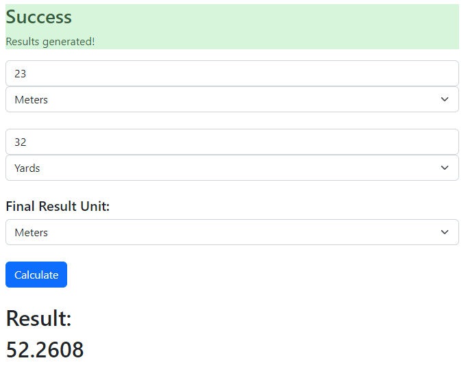
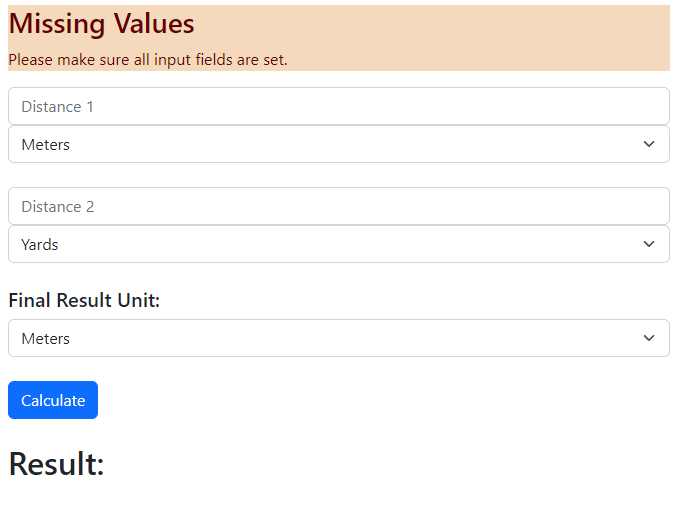

# WW Distance Calculator

A simple distance calculator using PHP, JS and HTML.

The following implementation will be creating a PHP web service which takes in five parameters (two distances and a corresponding metric unit for each, and a separate metric for the final result). Using simple HTML, the interface will provide users with a form through which they can specify the distances and an associated 'Calculate' button below to generate the final added total of both distances. The web service will also need to take into consideration potential conversions across the different metric units.

---

## The Approach

Keeping the above objective in mind, the project will be split into the following phases:

1. Designing a quick simple form through Figma to understand more clearly the required components needed.
2. Setting up the project space and HTML index file (including calling Bootstrap through CDN).
3. Creating the required HTML components and implementing the main form structure.
4. Building the PHP file hosting the API that will be used to receive the distance parameters, validate the inputs given and generate the respective response and result.
5. Setting up the event listener for the form interface that:

    - Calls the API hosted in the PHP server file and fetches response
    - Updates users using the feedback panel
    - If successful, displays result back to the user.

Extra:
Following testing of the application (and provided there is additional time available) the form can also be styled.

---

## Improvements

1. **Better PHP Debugging Tools**: The time for the overall task was split in order to research and determine the most ideal approach to debug the PHP component. As a final decision, the use of Postman along with the var_dump and echo functions, enabled me to quickly identify bugs throughout the code.

2. **Clarifying Variable Scopes**: On multiple occasions, variables scopes across local (function) levels and global in PHP led to most of the bugs encountered during the testing phases. By re-thinking and simplifying the structure of the class and its functions, the code became much more readable and easy to maintain.

3. **Feature Over Integration Testing**: A more effective solution over building and testing entire modules together could have been the breaking down and testing of individual features across the modules themselves. In other words, one could have tested the connection to the PHP service from the client's side first, ensure all request body parameters are sent and received successfully and finally echo back a simple success message. Ensuring the foundational setup is solid can lead to more effective testing phases in the later stages of the project.

---

## Example Runs

